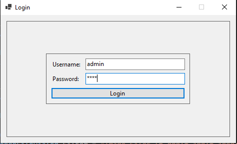
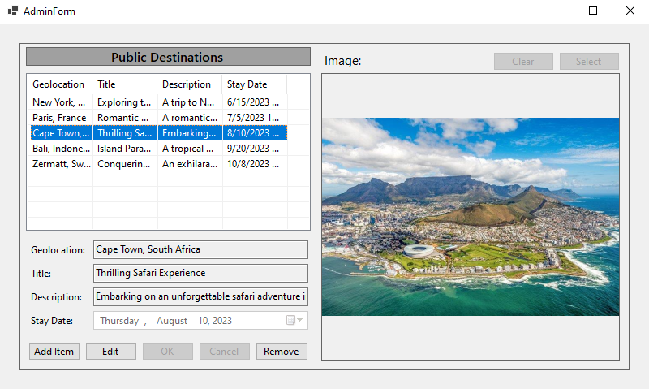

# Vacation Destinations Manager

This application helps bussinesses organize vacation destinations for their employees. The administrator can provide a list of public vacation destinations that is visible for all employees. The employees can build their own private list of destinations and also add public destinations to their private list.

This is a local desktop application. The admininistrator and each employee have an login account. This application should be accessible from a shared computer, for which every user has access to. The users will be asked to login when the program starts.

A vacation destination consists of the following properties:

* **Geolocation** (text)
* **Title** (text)
* **Image** (image - .png, .jpg, .jpeg, .bmp, etc)
* **Description** (text)
* **Stay Date** (date - yyyy/mm/dd)

## Installation

You should have a folder that contains the file "VacationDestinationManager.exe". Place this folder in a location of your choosing (for example "C:\Program Files"). To run the application you must open the ".exe" file. Make sure every user has access and necessary permissions to run this program. The files containing the destinations and login credentials are located at "C:\\Users\\[current windows account username]\\AppData\Local\\VacationDestinationManager\\VacationDestinationManager\\1.0.0\\". These files will be created after you run the application the first time.

Note that in this version when you run the application the first time, or if the files "destinations.csv" and "users.csv" are missing from the directory mentioned above, some sample data will be added. This sample data consists of:

* The admin account with username "admin" and password "1234", along with 5 public destinations.
* A user account with username "gigel" and password "gigi2002", along with 3 private destinations for this user.
* A user account with username "dorel" and password "lerod", along with 2 private destinations for this user.

## How to use

When you run the application you will see the login screen. Enter your credentials, then click "Login". To login as the administrator your username must be "admin".

### Admin

If you login as administrator the administrator window will open:

You can add public destinations by clicking the "Add item" button. This will allow you to edit a vacation destination from scratch. After you enter a geolocation, title, description and stay date you may optionally load a picture using the "Select" button. If you want to remove the selected picture click "Clear". Click "OK" to save the destination or "Cancel" to discard it.

You can edit a destination by selecting it from the list and clicking "Edit". This will allow you to start editing the destination. When you edit a destination the application will behave similarly to adding a destination, the only difference being that when you click "OK" the selected destination will be updated, rather than a new destination being added.

When you select a destination from the list it will be displayed in detail. You cannot select another destination while you are editing or adding a destination.

In order to remove a destination you must select it from the list, then click "Remove".
